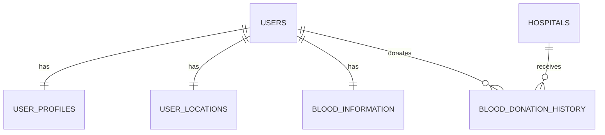
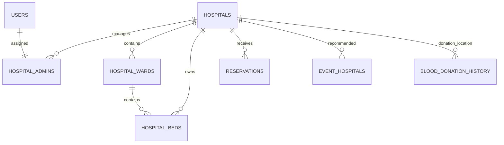
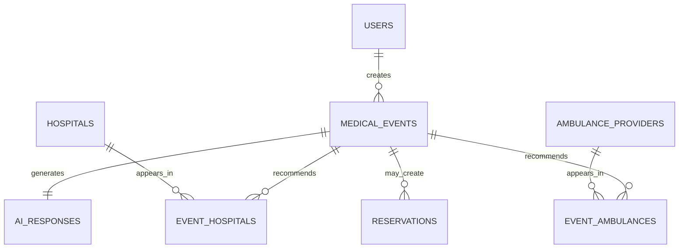
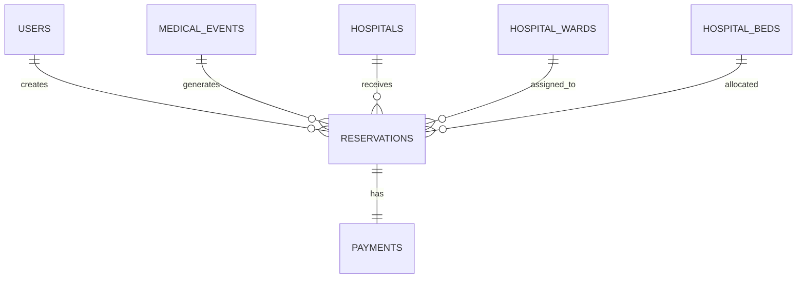
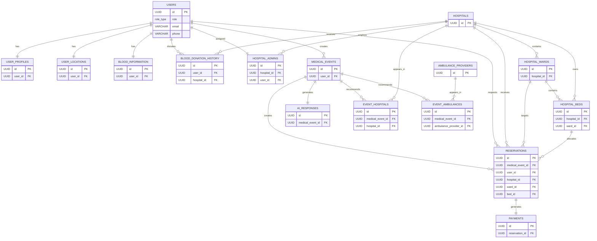

# MEDLINK Database Documentation

# Chapter 01 — Database Overview & ENUM Definitions

**Project Name:** MEDLINK – Connecting Care. Saving Lives.

**Version:** Phase 1 Database Design

**Database Version:** 1.0

**Document Version:** 1.0

**Last Updated:** August 2026

---

# Database Overview

## Database Name

`medlink`

---

## Database Management System (DBMS)

**PostgreSQL**

Version: PostgreSQL 18+

---

## Primary Extension Used

### pgcrypto

```sql
CREATE EXTENSION IF NOT EXISTS pgcrypto;
```

### Purpose

The `pgcrypto` extension is used to generate universally unique identifiers (UUIDs).

Instead of relying on sequential integer IDs (`1,2,3,4...`), MEDLINK uses UUIDs for every primary key.

Example:

```
07484367-c84d-4975-88e6-cc0f92ed64fa
```

UUIDs are generated using:

```sql
gen_random_uuid()
```

Example:

```sql
id UUID PRIMARY KEY DEFAULT gen_random_uuid()
```

---

# Database Purpose

The MEDLINK database has been designed to support a complete healthcare assistance platform.

The application connects patients with hospitals, AI-powered medical assistance, blood donors, and ambulance providers through a centralized backend system.

The database stores all persistent application data including:

- User Accounts
- User Profiles
- Blood Information
- Blood Donation History
- Hospitals
- Hospital Administrators
- Hospital Wards
- Hospital Beds
- Ambulance Providers
- AI Medical Consultations
- AI Responses
- Hospital Recommendations
- Ambulance Recommendations
- Hospital Reservations
- Payments

The design emphasizes:

- Data Integrity
- Scalability
- Normalization
- Security
- Performance
- Future Expansion

---

# Database Design Philosophy

The MEDLINK database follows several important database design principles.

---

## 1. UUID Primary Keys

Every major table uses UUIDs instead of integer IDs.

Example:

```sql
id UUID PRIMARY KEY DEFAULT gen_random_uuid()
```

### Reason

UUIDs provide:

- Better security
- Harder to guess record IDs
- Easier distributed systems
- Better API design
- Easier database merging

---

## 2. Third Normal Form (3NF)

The database is normalized.

Duplicate information is avoided whenever possible.

Example:

Instead of storing patient information inside reservations:

❌ Bad

```
reservation

patient_name

patient_phone
```

We store

```
reservation

user_id
```

and retrieve the remaining information from

```
users

↓

user_profiles
```

Benefits:

- Less duplicated data
- Easier updates
- Better consistency

---

## 3. Foreign Key Integrity

Every relationship is protected using Foreign Keys.

Example

```
reservation

↓

hospital
```

cannot reference a hospital that does not exist.

This prevents orphaned records.

---

## 4. ENUM-Based Business Rules

Instead of allowing random text,

MEDLINK uses ENUMs for controlled values.

Example

Instead of

```
status

"Pending"

"pending"

"waiting"

"PEND"
```

We only allow

```
PENDING
APPROVED
REJECTED
CANCELLED
COMPLETED
```

This guarantees consistent data.

---

## 5. Automatic Timestamp Management

Frequently updated tables include

```
updated_at
```

which is automatically maintained through PostgreSQL triggers.

Developers never need to update timestamps manually.

---

## 6. Logical Module Separation

The database is organized into several independent modules.

```
Users

Hospitals

Ambulances

Medical Events

Reservations

Payments
```

Each module has a clearly defined responsibility.

This keeps the project maintainable.

---

# Current Database Statistics

## Total Tables

15

---

## Total ENUM Types

11

---

## Total Custom Trigger Function

1

```
update_updated_at_column()
```

---

## Total Triggers

The following tables automatically update their `updated_at` column:

- users
- user_profiles
- user_locations
- blood_information
- hospitals
- hospital_wards
- ambulance_providers
- medical_events
- reservations

Total Trigger Instances:

9

---

# Database Modules

## Module 1 — User Management

Responsible for authentication and user information.

Tables:

- users
- user_profiles
- user_locations
- blood_information
- blood_donation_history

---

## Module 2 — Hospital Management

Responsible for hospital administration.

Tables:

- hospitals
- hospital_admins
- hospital_wards
- hospital_beds

---

## Module 3 — Ambulance Management

Responsible for ambulance provider information.

Tables:

- ambulance_providers

Phase 1 does not support ambulance booking.

Only contact information is stored.

---

## Module 4 — AI Medical Assistance

Responsible for AI consultations.

Tables:

- medical_events
- ai_responses
- event_hospitals
- event_ambulances

Each AI consultation becomes a medical event.

---

## Module 5 — Reservation Management

Responsible for hospital reservations.

Tables:

- reservations

Supports:

- Normal Reservation
- Emergency Reservation

---

## Module 6 — Payment Management

Responsible for billing information.

Tables:

- payments

Each reservation can have one payment.

---

# Database Security Principles

The following security decisions were intentionally made.

---

## Password Storage

Passwords are NEVER stored in plain text.

Only hashed passwords are stored.

Example

```
$2b$12$...
```

Hashing will be performed using:

```
bcrypt
```

inside the Express backend.

---

## UUID Exposure

Public APIs expose UUIDs instead of sequential IDs.

This prevents ID enumeration attacks.

---

## Role-Based Access

Users are assigned roles using the `role_type` ENUM.

Authorization is handled in the backend.

Supported roles:

- CUSTOMER
- SUPER_ADMIN
- HOSPITAL_ADMIN
- AMBULANCE_ADMIN

---

# Complete ENUM Definitions

---

## ENUM: role_type

### Purpose

Defines the role of every authenticated user.

### Used By

users.role

### Allowed Values

| Value | Description |
|-------|-------------|
| CUSTOMER | General application user |
| SUPER_ADMIN | System administrator |
| HOSPITAL_ADMIN | Hospital administrator |
| AMBULANCE_ADMIN | Ambulance management administrator |

---

## ENUM: gender_type

### Purpose

Represents user gender.

### Used By

user_profiles.gender

### Allowed Values

| Value | Description |
|-------|-------------|
| MALE | Male |
| FEMALE | Female |
| OTHER | Other |
| PREFER_NOT_TO_SAY | User prefers not to disclose |

---

## ENUM: blood_group_type

### Purpose

Stores blood group information.

### Used By

blood_information.blood_group

### Allowed Values

| Value |
|--------|
| A_POSITIVE |
| A_NEGATIVE |
| B_POSITIVE |
| B_NEGATIVE |
| AB_POSITIVE |
| AB_NEGATIVE |
| O_POSITIVE |
| O_NEGATIVE |

---

## ENUM: hospital_status_type

### Purpose

Represents the operational status of hospitals.

### Used By

hospitals.hospital_status

### Allowed Values

| Value | Description |
|-------|-------------|
| OPEN | Hospital currently accepting patients |
| CLOSED | Hospital unavailable |

---

## ENUM: bed_status_type

### Purpose

Represents the availability of individual beds.

### Used By

hospital_beds.bed_status

### Allowed Values

| Value | Description |
|-------|-------------|
| AVAILABLE | Bed is available |
| OCCUPIED | Bed currently assigned to a patient |
| RESERVED | Bed reserved for an incoming patient |
| MAINTENANCE | Bed temporarily unavailable |

---

## ENUM: severity_type

### Purpose

Represents the severity determined by the AI.

### Used By

medical_events.severity

### Allowed Values

| Value | Description |
|-------|-------------|
| LOW | Minor condition |
| MEDIUM | Requires medical attention |
| HIGH | Serious condition |
| CRITICAL | Life-threatening emergency |

---

## ENUM: event_status_type

### Purpose

Represents the processing status of an AI consultation.

### Used By

medical_events.event_status

### Allowed Values

| Value | Description |
|-------|-------------|
| PENDING | AI processing has not finished |
| COMPLETED | AI consultation completed |
| CANCELLED | Consultation cancelled |

---

## ENUM: reservation_mode_type

### Purpose

Determines how the reservation was created.

### Used By

reservations.reservation_mode

### Allowed Values

| Value | Description |
|-------|-------------|
| NORMAL | Standard reservation |
| EMERGENCY | Emergency reservation generated by AI or SOS |

---

## ENUM: reservation_status_type

### Purpose

Represents the lifecycle of a reservation.

### Used By

reservations.reservation_status

### Allowed Values

| Value | Description |
|-------|-------------|
| PENDING | Waiting for hospital review |
| APPROVED | Hospital accepted reservation |
| REJECTED | Hospital rejected reservation |
| CANCELLED | Reservation cancelled |
| COMPLETED | Patient admitted and reservation finished |

---

## ENUM: payment_method_type

### Purpose

Represents how a payment is made.

### Used By

payments.payment_method

### Allowed Values

| Value | Description |
|-------|-------------|
| CASH | Cash payment |
| CARD | Debit or Credit Card |
| MOBILE_BANKING | Mobile financial service |
| INSURANCE | Insurance payment |

---

## ENUM: payment_status_type

### Purpose

Represents the current payment status.

### Used By

payments.payment_status

### Allowed Values

| Value | Description |
|-------|-------------|
| UNPAID | No payment has been made |
| PARTIALLY_PAID | Partial amount has been received |
| PAID | Full payment completed |
| REFUNDED | Payment refunded |

---

# Summary

The MEDLINK database is a fully normalized PostgreSQL database designed around healthcare workflows. It uses UUID primary keys, strict foreign key relationships, ENUM-based business rules, automatic timestamp management, and modular separation of concerns to create a secure, scalable, and maintainable foundation for the application's backend.

This database serves as the core persistence layer for authentication, hospital management, AI-assisted medical consultations, ambulance information, reservations, and payment processing.

The following chapters document every table, relationship, trigger, function, and architectural decision in complete detail.


# Chapter 02 — User Module

The **User Module** is the foundation of the MEDLINK system. Every person who accesses the application is represented here, regardless of whether they are a customer, hospital administrator, ambulance administrator, or super administrator.

This module is responsible for:

- Authentication
- Authorization
- Personal Information
- User Location
- Blood Information
- Blood Donation History

---

# User Module Architecture

```text
users
│
├────────────── user_profiles
│
├────────────── user_locations
│
├────────────── blood_information
│
└────────────── blood_donation_history
```

Relationship Summary

| Parent Table | Child Table | Relationship |
|--------------|------------|--------------|
| users | user_profiles | 1 : 1 |
| users | user_locations | 1 : 1 |
| users | blood_information | 1 : 1 |
| users | blood_donation_history | 1 : N |

---

# Table: users

## Purpose

The `users` table stores the authentication credentials of every account in the system.

This table **does not store personal information** such as names or addresses. Those are stored separately in `user_profiles` to maintain proper normalization.

Every authenticated account in the application must have exactly one record in this table.

Supported roles include:

- Customer
- Super Admin
- Hospital Admin
- Ambulance Admin

---

## Columns

| Column Name | Data Type | Nullable | Default | Constraints / Keys | Purpose & Reason |
|-------------|----------|----------|----------|--------------------|------------------|
| id | UUID | No | gen_random_uuid() | Primary Key | Unique identifier for every user. UUIDs prevent predictable IDs and improve security. |
| role | role_type | No | — | ENUM | Defines the user's role and permissions within the application. |
| email | VARCHAR(255) | No | — | UNIQUE | Login email. Must be unique across all users. |
| phone | VARCHAR(20) | No | — | UNIQUE | Login phone number. Must be unique across all users. |
| password_hash | TEXT | No | — | None | Stores the bcrypt hashed password. Plain text passwords are never stored. |
| is_verified | BOOLEAN | No | FALSE | None | Indicates whether the user has verified their account. |
| is_active | BOOLEAN | No | TRUE | None | Allows administrators to disable accounts without deleting them. |
| last_login | TIMESTAMPTZ | Yes | NULL | None | Stores the timestamp of the user's most recent successful login. |
| created_at | TIMESTAMPTZ | No | CURRENT_TIMESTAMP | None | Timestamp indicating when the account was created. |
| updated_at | TIMESTAMPTZ | No | CURRENT_TIMESTAMP | Trigger Updated | Automatically updated whenever the record changes. |

---

## Primary Key

```
id
```

---

## Foreign Keys

None

This is the parent table for several other tables.

---

## Referenced By

- user_profiles
- user_locations
- blood_information
- blood_donation_history
- hospital_admins
- medical_events
- reservations

---

## Business Rules

- Every user must have exactly one role.
- Email addresses must be unique.
- Phone numbers must be unique.
- Passwords are always stored as bcrypt hashes.
- Soft deletion is handled using `is_active` instead of deleting records.
- `updated_at` is automatically maintained by a trigger.

---

# Table: user_profiles

## Purpose

The `user_profiles` table stores the personal information of each user.

Separating profile data from authentication data follows database normalization principles and improves maintainability.

Every user has exactly one profile.

---

## Columns

| Column Name | Data Type | Nullable | Default | Constraints / Keys | Purpose & Reason |
|-------------|----------|----------|----------|--------------------|------------------|
| id | UUID | No | gen_random_uuid() | Primary Key | Unique identifier for the profile. |
| user_id | UUID | No | — | FK → users(id), UNIQUE | Connects the profile to its corresponding user account. One user can only have one profile. |
| first_name | VARCHAR(100) | No | — | None | User's first name. |
| last_name | VARCHAR(100) | No | — | None | User's last name. |
| gender | gender_type | No | — | ENUM | User's gender. |
| date_of_birth | DATE | No | — | None | Used for age calculation and healthcare information. |
| national_id | VARCHAR(30) | Yes | NULL | UNIQUE | Optional government-issued identification number. |
| address | TEXT | No | — | None | User's residential address. |
| emergency_contact_name | VARCHAR(200) | No | — | None | Primary emergency contact person's name. |
| emergency_contact_phone | VARCHAR(20) | No | — | None | Emergency contact phone number. |
| created_at | TIMESTAMPTZ | No | CURRENT_TIMESTAMP | None | Record creation timestamp. |
| updated_at | TIMESTAMPTZ | No | CURRENT_TIMESTAMP | Trigger Updated | Automatically maintained timestamp. |

---

## Primary Key

```
id
```

---

## Foreign Keys

| Column | References |
|----------|------------|
| user_id | users(id) |

---

## Business Rules

- Every user can own only one profile.
- Personal information is separated from authentication data.
- Emergency contact information is mandatory.

---

# Table: user_locations

## Purpose

Stores the user's most recent geographical location.

This information is primarily used to recommend nearby hospitals and ambulance providers.

Each user can have only one current location.

---

## Columns

| Column Name | Data Type | Nullable | Default | Constraints / Keys | Purpose & Reason |
|-------------|----------|----------|----------|--------------------|------------------|
| id | UUID | No | gen_random_uuid() | Primary Key | Unique location record. |
| user_id | UUID | No | — | FK → users(id), UNIQUE | Associates the location with one user. |
| latitude | NUMERIC(9,6) | No | — | CHECK | Latitude coordinate. Valid range: -90 to 90. |
| longitude | NUMERIC(9,6) | No | — | CHECK | Longitude coordinate. Valid range: -180 to 180. |
| updated_at | TIMESTAMPTZ | No | CURRENT_TIMESTAMP | Trigger Updated | Stores the last location update timestamp. |

---

## Primary Key

```
id
```

---

## Foreign Keys

| Column | References |
|----------|------------|
| user_id | users(id) |

---

## Business Rules

- One location per user.
- Latitude and longitude are validated using CHECK constraints.
- Location updates overwrite previous coordinates.

---

# Table: blood_information

## Purpose

Stores the user's current blood donation status.

This table enables the Blood Donation feature by indicating whether a user is currently eligible to donate.

Each user has exactly one blood information record.

---

## Columns

| Column Name | Data Type | Nullable | Default | Constraints / Keys | Purpose & Reason |
|-------------|----------|----------|----------|--------------------|------------------|
| id | UUID | No | gen_random_uuid() | Primary Key | Unique blood information record. |
| user_id | UUID | No | — | FK → users(id), UNIQUE | Associates blood information with one user. |
| blood_group | blood_group_type | No | — | ENUM | User's blood group. |
| last_donation_date | DATE | Yes | NULL | None | Most recent blood donation date. |
| can_donate | BOOLEAN | No | TRUE | None | Indicates whether the user is medically eligible to donate. |
| next_available_date | DATE | Yes | NULL | None | Date on which the user becomes eligible again. |
| is_available_for_donation | BOOLEAN | No | TRUE | None | User-controlled availability status shown to others. |
| updated_at | TIMESTAMPTZ | No | CURRENT_TIMESTAMP | Trigger Updated | Automatically maintained timestamp. |

---

## Primary Key

```
id
```

---

## Foreign Keys

| Column | References |
|----------|------------|
| user_id | users(id) |

---

## Business Rules

- Every user has one blood information record.
- Medical eligibility and public availability are stored separately.
- Blood group uses a controlled ENUM.

---

# Table: blood_donation_history

## Purpose

Maintains a permanent history of every blood donation performed by a user.

Unlike `blood_information`, this table stores historical records rather than the current status.

A user may donate blood many times throughout their lifetime.

---

## Columns

| Column Name | Data Type | Nullable | Default | Constraints / Keys | Purpose & Reason |
|-------------|----------|----------|----------|--------------------|------------------|
| id | UUID | No | gen_random_uuid() | Primary Key | Unique donation history record. |
| user_id | UUID | No | — | FK → users(id) | User who donated blood. |
| hospital_id | UUID | Yes | NULL | FK → hospitals(id) | Hospital where the donation occurred. Uses `ON DELETE SET NULL` to preserve history if the hospital record is removed. |
| donation_date | DATE | No | — | None | Date of the blood donation. |
| remarks | TEXT | Yes | NULL | None | Optional notes about the donation. |
| created_at | TIMESTAMPTZ | No | CURRENT_TIMESTAMP | None | Timestamp indicating when the history record was created. |

---

## Primary Key

```
id
```

---

## Foreign Keys

| Column | References |
|----------|------------|
| user_id | users(id) |
| hospital_id | hospitals(id) |

---

## Business Rules

- A user may have many donation history records.
- Donation history is never deleted when a hospital is removed.
- Historical medical data should always be preserved.

---

# User Module Relationship Diagram



---

# User Module Summary

The User Module forms the identity layer of the MEDLINK system. It separates authentication, personal information, location, and blood-related data into distinct normalized tables, ensuring high data integrity, reduced redundancy, and easier future maintenance.

This design supports:

- Secure authentication
- Role-based authorization
- Profile management
- Real-time location tracking
- Blood donor discovery
- Donation history management

while remaining scalable for future enhancements such as OTP verification, multiple addresses, medical records, or family-linked accounts.

# Chapter 03 — Hospital Module

The **Hospital Module** is responsible for managing all healthcare facilities registered within the MEDLINK platform.

It stores information about:

- Hospitals
- Hospital Administrators
- Hospital Wards
- Hospital Beds

This module enables customers to:

- View nearby hospitals
- View hospital details
- Check bed availability
- Reserve hospital beds
- Reserve ICU beds

Hospital administrators use this module to:

- Manage hospital information
- Approve or reject reservations
- Monitor bed occupancy
- Update bed availability

---

# Hospital Module Architecture

```text
hospitals
│
├────────────── hospital_admins
│
├────────────── hospital_wards
│                    │
│                    │
│              hospital_beds
│
├────────────── reservations
│
├────────────── event_hospitals
│
└────────────── blood_donation_history
```

---

# Relationship Summary

| Parent Table | Child Table | Relationship |
|--------------|------------|--------------|
| hospitals | hospital_admins | 1 : N |
| hospitals | hospital_wards | 1 : N |
| hospital_wards | hospital_beds | 1 : N |
| hospitals | hospital_beds | 1 : N |
| hospitals | reservations | 1 : N |
| hospitals | event_hospitals | 1 : N |
| hospitals | blood_donation_history | 1 : N |

---

# Table: hospitals

## Purpose

The `hospitals` table stores every hospital registered within the MEDLINK platform.

This is one of the core tables of the entire database.

Every hospital has:

- Basic contact information
- Geographic coordinates
- Operational status
- Description

The geographical coordinates allow the backend to recommend nearby hospitals based on the user's current location.

---

## Columns

| Column Name | Data Type | Nullable | Default | Constraints / Keys | Purpose & Reason |
|-------------|----------|----------|----------|--------------------|------------------|
| id | UUID | No | gen_random_uuid() | Primary Key | Unique identifier for every hospital. |
| hospital_name | VARCHAR(255) | No | — | None | Official hospital name displayed throughout the application. |
| license_number | VARCHAR(100) | No | — | UNIQUE | Government-issued hospital license number. Prevents duplicate registrations. |
| email | VARCHAR(255) | No | — | UNIQUE | Official hospital email address. |
| phone | VARCHAR(20) | No | — | UNIQUE | Hospital contact number. |
| website | VARCHAR(255) | Yes | NULL | None | Official hospital website. |
| address | TEXT | No | — | None | Complete hospital address. |
| latitude | NUMERIC(9,6) | No | — | CHECK | Geographic latitude used for nearby hospital search. |
| longitude | NUMERIC(9,6) | No | — | CHECK | Geographic longitude used for nearby hospital search. |
| hospital_status | hospital_status_type | No | OPEN | ENUM | Indicates whether the hospital is currently accepting patients. |
| description | TEXT | Yes | NULL | None | Short description of the hospital. |
| created_at | TIMESTAMPTZ | No | CURRENT_TIMESTAMP | None | Timestamp when the hospital record was created. |
| updated_at | TIMESTAMPTZ | No | CURRENT_TIMESTAMP | Trigger Updated | Automatically updated whenever the hospital information changes. |

---

## Primary Key

```
id
```

---

## Foreign Keys

None

---

## Referenced By

- hospital_admins
- hospital_wards
- hospital_beds
- reservations
- event_hospitals
- blood_donation_history

---

## Business Rules

- Every hospital must have a unique license number.
- Every hospital must have a unique email.
- Every hospital must have a unique phone number.
- Latitude must be between **-90** and **90**.
- Longitude must be between **-180** and **180**.
- Hospital status is restricted by an ENUM.
- Location is stored to support nearest-hospital recommendations.

---

# Table: hospital_admins

## Purpose

The `hospital_admins` table connects user accounts with hospitals.

A hospital administrator is simply a user whose role is `HOSPITAL_ADMIN`.

This table defines **which hospital that administrator manages**.

Keeping this relationship in a separate table allows administrators to be reassigned without modifying the hospital record itself.

---

## Columns

| Column Name | Data Type | Nullable | Default | Constraints / Keys | Purpose & Reason |
|-------------|----------|----------|----------|--------------------|------------------|
| id | UUID | No | gen_random_uuid() | Primary Key | Unique administrator assignment record. |
| hospital_id | UUID | No | — | FK → hospitals(id) | Hospital managed by the administrator. |
| user_id | UUID | No | — | FK → users(id), UNIQUE | User account assigned as hospital administrator. |
| joined_at | TIMESTAMPTZ | No | CURRENT_TIMESTAMP | None | Date and time when the administrator joined the hospital. |

---

## Primary Key

```
id
```

---

## Foreign Keys

| Column | References |
|----------|------------|
| hospital_id | hospitals(id) |
| user_id | users(id) |

---

## Business Rules

- One administrator account manages one hospital.
- Every hospital administrator must already exist in the `users` table.
- Deleting a hospital removes its administrator assignments.
- Deleting a user removes the administrator assignment.

---

# Table: hospital_wards

## Purpose

Hospitals consist of multiple wards.

Examples include:

- General Ward
- ICU
- VIP Cabin
- Emergency Ward
- Pediatrics

This table defines every ward available within each hospital.

---

## Columns

| Column Name | Data Type | Nullable | Default | Constraints / Keys | Purpose & Reason |
|-------------|----------|----------|----------|--------------------|------------------|
| id | UUID | No | gen_random_uuid() | Primary Key | Unique ward identifier. |
| hospital_id | UUID | No | — | FK → hospitals(id) | Hospital that owns this ward. |
| ward_name | VARCHAR(100) | No | — | UNIQUE (hospital_id, ward_name) | Name of the ward. Unique within each hospital. |
| description | TEXT | Yes | NULL | None | Additional information about the ward. |
| created_at | TIMESTAMPTZ | No | CURRENT_TIMESTAMP | None | Timestamp when the ward was created. |
| updated_at | TIMESTAMPTZ | No | CURRENT_TIMESTAMP | Trigger Updated | Automatically maintained timestamp. |

---

## Primary Key

```
id
```

---

## Foreign Keys

| Column | References |
|----------|------------|
| hospital_id | hospitals(id) |

---

## Business Rules

- Every ward belongs to exactly one hospital.
- A hospital cannot have two wards with the same name.
- Wards can contain multiple beds.

---

# Table: hospital_beds

## Purpose

The `hospital_beds` table stores every individual hospital bed.

Instead of simply storing the number of available beds, each bed has its own record.

This provides complete flexibility for future features such as:

- Bed assignment
- Patient admission
- Bed maintenance
- Reservation tracking
- Occupancy analytics

---

## Columns

| Column Name | Data Type | Nullable | Default | Constraints / Keys | Purpose & Reason |
|-------------|----------|----------|----------|--------------------|------------------|
| id | UUID | No | gen_random_uuid() | Primary Key | Unique identifier for every hospital bed. |
| hospital_id | UUID | No | — | FK → hospitals(id) | Hospital containing the bed. |
| ward_id | UUID | No | — | FK → hospital_wards(id) | Ward containing the bed. |
| bed_number | VARCHAR(30) | No | — | UNIQUE (hospital_id, bed_number) | Human-readable bed identifier such as G-101 or ICU-05. |
| bed_status | bed_status_type | No | AVAILABLE | ENUM | Current status of the bed. |
| created_at | TIMESTAMPTZ | No | CURRENT_TIMESTAMP | None | Record creation timestamp. |
| updated_at | TIMESTAMPTZ | No | CURRENT_TIMESTAMP | Trigger Updated | Automatically updated whenever the bed status changes. |

---

## Primary Key

```
id
```

---

## Foreign Keys

| Column | References |
|----------|------------|
| hospital_id | hospitals(id) |
| ward_id | hospital_wards(id) |

---

## Business Rules

- Every bed belongs to one hospital.
- Every bed belongs to one ward.
- Bed numbers are unique within a hospital.
- Bed availability is controlled through the `bed_status_type` ENUM.
- Beds are the lowest level of the hospital hierarchy.

---

# Hospital Module Relationship Diagram



---

# Hospital Module Hierarchy

The hierarchy of the Hospital Module is illustrated below:

```text
Hospital
│
├── Hospital Administrator(s)
│
├── Ward
│      │
│      ├── Bed
│      ├── Bed
│      ├── Bed
│      └── Bed
│
├── Ward
│      │
│      ├── Bed
│      ├── Bed
│      └── Bed
│
└── Ward
       │
       ├── Bed
       └── Bed
```

This hierarchical design makes it simple to determine:

- Which hospital owns a bed
- Which ward a bed belongs to
- Which administrator manages the hospital
- Which reservations target a hospital
- Which hospitals are recommended by the AI

---

# Hospital Module Summary

The Hospital Module represents the healthcare infrastructure of the MEDLINK platform. It models hospitals using a normalized hierarchy of hospitals, administrators, wards, and beds.

This design provides:

- Centralized hospital management
- Accurate bed-level tracking
- Flexible ward organization
- Hospital administrator assignment
- Location-based hospital recommendations
- Future scalability for occupancy analytics, patient admissions, and advanced hospital operations

By representing each bed as an individual record instead of storing simple counts, the database is prepared for future enhancements such as real-time occupancy management, patient allocation, maintenance scheduling, and resource optimization.

# Chapter 04 — AI & Medical Event Module

The **AI & Medical Event Module** is the intelligent core of the MEDLINK platform.

This module is responsible for:

- Receiving a user's medical complaint
- Creating a medical event
- Sending the complaint to the AI service
- Storing the AI-generated response
- Recommending nearby hospitals
- Recommending nearby ambulance providers

Every time a customer requests AI Medical Assistance, a new **Medical Event** is created.

That event becomes the parent record for:

- AI Response
- Recommended Hospitals
- Recommended Ambulances
- Hospital Reservation

This design allows every AI consultation to be permanently stored and viewed later in the user's event history.

---

# AI Module Architecture

```text
users
   │
   │
medical_events
   │
   ├──────────── ai_responses
   │
   ├──────────── event_hospitals
   │                   │
   │                   ▼
   │              hospitals
   │
   └──────────── event_ambulances
                       │
                       ▼
             ambulance_providers
```

---

# Relationship Summary

| Parent Table | Child Table | Relationship |
|--------------|------------|--------------|
| users | medical_events | 1 : N |
| medical_events | ai_responses | 1 : 1 |
| medical_events | event_hospitals | 1 : N |
| medical_events | event_ambulances | 1 : N |
| hospitals | event_hospitals | 1 : N |
| ambulance_providers | event_ambulances | 1 : N |

---

# Table: medical_events

## Purpose

The `medical_events` table represents every AI medical consultation requested by a user.

Whenever a customer presses the **AI Medical Assistance** button and submits a medical description, a new medical event is created.

The event stores:

- User description
- Event location
- AI severity
- Event status
- Emergency flag

Every AI response, recommendation, and reservation is linked to this table.

This makes `medical_events` one of the central tables of the MEDLINK database.

---

## Columns

| Column Name | Data Type | Nullable | Default | Constraints / Keys | Purpose & Reason |
|-------------|----------|----------|----------|--------------------|------------------|
| id | UUID | No | gen_random_uuid() | Primary Key | Unique identifier for every medical consultation. |
| user_id | UUID | No | — | FK → users(id) | User who requested AI medical assistance. |
| user_description | TEXT | No | — | None | Natural language description of the user's medical problem. |
| event_location_latitude | NUMERIC(9,6) | No | — | CHECK | Latitude where the event occurred. Used for hospital recommendations. |
| event_location_longitude | NUMERIC(9,6) | No | — | CHECK | Longitude where the event occurred. Used for hospital recommendations. |
| severity | severity_type | No | — | ENUM | Severity determined by the AI. |
| event_status | event_status_type | No | PENDING | ENUM | Current processing status of the medical event. |
| is_emergency | BOOLEAN | No | FALSE | None | Indicates whether this consultation should be treated as an emergency. |
| created_at | TIMESTAMPTZ | No | CURRENT_TIMESTAMP | None | Timestamp when the medical event was created. |
| updated_at | TIMESTAMPTZ | No | CURRENT_TIMESTAMP | Trigger Updated | Automatically updated whenever the event changes. |

---

## Primary Key

```
id
```

---

## Foreign Keys

| Column | References |
|----------|------------|
| user_id | users(id) |

---

## Referenced By

- ai_responses
- event_hospitals
- event_ambulances
- reservations

---

## Business Rules

- Every medical event belongs to one user.
- One user may create many medical events.
- Every event stores the user's original medical description.
- Event location is stored separately from the user's profile location because emergencies may occur anywhere.
- Emergency events may bypass the normal reservation workflow.

---

# Table: ai_responses

## Purpose

The `ai_responses` table stores the structured medical guidance generated by the AI.

Instead of storing the AI output inside the `medical_events` table, it is separated into its own table to maintain normalization and make future AI model upgrades easier.

Each medical event has exactly one AI response.

---

## Columns

| Column Name | Data Type | Nullable | Default | Constraints / Keys | Purpose & Reason |
|-------------|----------|----------|----------|--------------------|------------------|
| id | UUID | No | gen_random_uuid() | Primary Key | Unique AI response identifier. |
| medical_event_id | UUID | No | — | FK → medical_events(id), UNIQUE | Associates the AI response with exactly one medical event. |
| summary | TEXT | No | — | None | AI-generated summary of the medical situation. |
| possible_conditions | TEXT | No | — | None | List or explanation of possible medical conditions identified by the AI. |
| tags | TEXT | Yes | NULL | None | Keywords generated by the AI to categorize the event. |
| first_aid | TEXT | No | — | None | AI-generated first aid instructions before professional treatment. |
| created_at | TIMESTAMPTZ | No | CURRENT_TIMESTAMP | None | Timestamp when the AI response was stored. |

---

## Primary Key

```
id
```

---

## Foreign Keys

| Column | References |
|----------|------------|
| medical_event_id | medical_events(id) |

---

## Business Rules

- One medical event has one AI response.
- AI responses are permanent records.
- AI recommendations are advisory and do not replace professional medical diagnosis.

---

# Table: event_hospitals

## Purpose

The `event_hospitals` table stores the hospitals recommended for a particular medical event.

The backend determines nearby hospitals using the event's latitude and longitude.

Rather than storing only one hospital, this table allows multiple hospitals to be recommended in ranked order (future enhancement).

This table acts as a bridge between medical events and hospitals.

---

## Columns

| Column Name | Data Type | Nullable | Default | Constraints / Keys | Purpose & Reason |
|-------------|----------|----------|----------|--------------------|------------------|
| id | UUID | No | gen_random_uuid() | Primary Key | Unique recommendation record. |
| medical_event_id | UUID | No | — | FK → medical_events(id) | Medical event receiving the recommendation. |
| hospital_id | UUID | No | — | FK → hospitals(id) | Recommended hospital. |
| created_at | TIMESTAMPTZ | No | CURRENT_TIMESTAMP | None | Timestamp when the recommendation was generated. |

---

## Primary Key

```
id
```

---

## Foreign Keys

| Column | References |
|----------|------------|
| medical_event_id | medical_events(id) |
| hospital_id | hospitals(id) |

---

## Business Rules

- One medical event may recommend multiple hospitals.
- A hospital may appear in many medical events.
- Duplicate recommendations are prevented by the unique constraint on `(medical_event_id, hospital_id)`.
- Recommendations are generated based on proximity in Phase 1.

---

# Table: event_ambulances

## Purpose

The `event_ambulances` table stores ambulance providers recommended for a particular medical event.

Phase 1 does **not** implement ambulance booking.

Instead, the backend attaches nearby ambulance provider contact information to the AI consultation.

This table creates the relationship between a medical event and available ambulance providers.

---

## Columns

| Column Name | Data Type | Nullable | Default | Constraints / Keys | Purpose & Reason |
|-------------|----------|----------|----------|--------------------|------------------|
| id | UUID | No | gen_random_uuid() | Primary Key | Unique ambulance recommendation record. |
| medical_event_id | UUID | No | — | FK → medical_events(id) | Medical event receiving the recommendation. |
| ambulance_provider_id | UUID | No | — | FK → ambulance_providers(id) | Recommended ambulance provider. |
| created_at | TIMESTAMPTZ | No | CURRENT_TIMESTAMP | None | Timestamp when the recommendation was generated. |

---

## Primary Key

```
id
```

---

## Foreign Keys

| Column | References |
|----------|------------|
| medical_event_id | medical_events(id) |
| ambulance_provider_id | ambulance_providers(id) |

---

## Business Rules

- One medical event may recommend multiple ambulance providers.
- One ambulance provider may appear in many medical events.
- Duplicate recommendations are prevented by the unique constraint on `(medical_event_id, ambulance_provider_id)`.
- Phase 1 only stores contact information; booking and dispatch are planned for Phase 2.

---

# AI Module Relationship Diagram



---

# AI Consultation Workflow

```text
Customer
    │
    ▼
Describe Medical Problem
    │
    ▼
Create Medical Event
    │
    ▼
Send Prompt to AI
    │
    ▼
Receive AI Response
    │
    ▼
Determine Severity
    │
    ▼
Find Nearby Hospitals
    │
    ▼
Find Nearby Ambulance Providers
    │
    ▼
Store Recommendations
    │
    ▼
Display Event Details
    │
    ▼
(Optional)
Reserve Hospital Bed
```

---

# Phase 1 Design Notes

The AI & Medical Event Module has been intentionally designed to support future enhancements without requiring structural changes to the database.

Planned future capabilities include:

- AI confidence scores
- Medical specialty recommendations
- Multiple AI model support
- Hospital recommendation ranking
- Distance and travel time calculations
- AI conversation history
- Follow-up consultations
- Ambulance dispatch integration
- Live ambulance tracking
- Doctor assignment
- Patient outcome tracking

Because the current design separates medical events, AI responses, hospitals, and ambulance providers into dedicated tables, these features can be added with minimal impact on the existing schema.

---

# AI Module Summary

The AI & Medical Event Module serves as the intelligence layer of the MEDLINK platform. It transforms a user's natural-language medical description into a structured healthcare workflow by creating a medical event, storing the AI-generated medical guidance, recommending nearby hospitals and ambulance providers, and acting as the starting point for emergency or standard hospital reservations.

This modular design ensures that every consultation is fully traceable, historically preserved, and extensible for future AI-powered healthcare services while maintaining a normalized and scalable PostgreSQL database structure.

# Chapter 05 — Reservation & Payment Module

The **Reservation & Payment Module** manages the complete hospital reservation workflow within the MEDLINK platform.

This module is responsible for:

- Receiving hospital reservation requests
- Linking reservations to AI medical events
- Tracking reservation approval status
- Assigning hospital wards and beds
- Recording payment information for hospital services

Every reservation begins from a **Medical Event** and is associated with:

- A customer
- A hospital
- A ward
- (Optionally) a specific bed

Once a reservation is completed and the patient receives services, a corresponding payment record can be created.

---

# Reservation Module Architecture

```text
medical_events
        │
        ▼
 reservations
        │
        ├──────────── users
        │
        ├──────────── hospitals
        │
        ├──────────── hospital_wards
        │
        ├──────────── hospital_beds
        │
        ▼
     payments
```

---

# Relationship Summary

| Parent Table | Child Table | Relationship |
|--------------|------------|--------------|
| medical_events | reservations | 1 : N |
| users | reservations | 1 : N |
| hospitals | reservations | 1 : N |
| hospital_wards | reservations | 1 : N |
| hospital_beds | reservations | 1 : N (Optional) |
| reservations | payments | 1 : 1 |

---

# Table: reservations

## Purpose

The `reservations` table stores every hospital reservation request created through the MEDLINK application.

Reservations may be created in two ways:

### Normal Reservation

The customer:

- Views recommended hospitals
- Selects a hospital
- Chooses a ward
- Submits the reservation request

Hospital administrators then review the request before approving or rejecting it.

---

### Emergency Reservation

Emergency reservations are automatically generated when:

- The customer logs in using **Emergency Login (SOS)**

or

- The AI classifies the case as **CRITICAL**

In this situation the reservation skips most user input and is immediately submitted to the selected hospital.

---

## Columns

| Column Name | Data Type | Nullable | Default | Constraints / Keys | Purpose & Reason |
|-------------|----------|----------|----------|--------------------|------------------|
| id | UUID | No | gen_random_uuid() | Primary Key | Unique reservation identifier. |
| medical_event_id | UUID | No | — | FK → medical_events(id) | Medical event that generated this reservation. |
| user_id | UUID | No | — | FK → users(id) | Customer requesting the reservation. |
| hospital_id | UUID | No | — | FK → hospitals(id) | Hospital receiving the reservation request. |
| ward_id | UUID | No | — | FK → hospital_wards(id) | Requested ward within the hospital. |
| bed_id | UUID | Yes | NULL | FK → hospital_beds(id) | Assigned hospital bed. Nullable because assignment usually occurs after approval. |
| reservation_mode | reservation_mode_type | No | — | ENUM | Indicates whether the reservation is NORMAL or EMERGENCY. |
| reservation_status | reservation_status_type | No | PENDING | ENUM | Current processing state of the reservation. |
| requested_at | TIMESTAMPTZ | No | CURRENT_TIMESTAMP | None | Time when the reservation request was submitted. |
| approved_at | TIMESTAMPTZ | Yes | NULL | None | Time when the reservation was approved. Remains NULL until approval. |
| created_at | TIMESTAMPTZ | No | CURRENT_TIMESTAMP | None | Timestamp when the reservation record was created. |
| updated_at | TIMESTAMPTZ | No | CURRENT_TIMESTAMP | Trigger Updated | Automatically updated whenever the reservation changes. |

---

## Primary Key

```
id
```

---

## Foreign Keys

| Column | References |
|----------|------------|
| medical_event_id | medical_events(id) |
| user_id | users(id) |
| hospital_id | hospitals(id) |
| ward_id | hospital_wards(id) |
| bed_id | hospital_beds(id) |

---

## Referenced By

- payments

---

## Business Rules

- Every reservation belongs to one medical event.
- Every reservation belongs to one customer.
- Every reservation is submitted to one hospital.
- Every reservation targets one hospital ward.
- A bed assignment is optional during creation and may occur later.
- Reservation mode determines whether the request follows the normal or emergency workflow.
- Reservation status is controlled using an ENUM.
- The `approved_at` timestamp is populated only after approval.
- The `updated_at` column is maintained automatically by a database trigger.

---

# Reservation Workflow

## Normal Reservation

```text
Customer
      │
      ▼
Medical Event Created
      │
      ▼
Recommended Hospitals
      │
      ▼
Select Hospital
      │
      ▼
Select Ward
      │
      ▼
Create Reservation
      │
      ▼
Hospital Reviews Request
      │
      ├────────► Approve
      │               │
      │               ▼
      │         Assign Bed
      │               │
      │               ▼
      │          Patient Arrives
      │
      └────────► Reject
```

---

## Emergency Reservation

```text
Emergency Login
        │
        ▼
AI Marks Critical
        │
        ▼
Reservation Automatically Created
        │
        ▼
Hospital Receives Emergency Request
        │
        ▼
Approve Immediately
        │
        ▼
Assign Bed
```

---

# Table: payments

## Purpose

The `payments` table stores financial information associated with hospital reservations.

A payment record is created only after a reservation exists.

Because every reservation can have only one payment record in the current system, a **one-to-one relationship** is enforced using a UNIQUE constraint on `reservation_id`.

This design supports the Phase 1 requirement of tracking a single bill per reservation while allowing future expansion if multiple invoices or installment payments are introduced.

---

## Columns

| Column Name | Data Type | Nullable | Default | Constraints / Keys | Purpose & Reason |
|-------------|----------|----------|----------|--------------------|------------------|
| id | UUID | No | gen_random_uuid() | Primary Key | Unique payment identifier. |
| reservation_id | UUID | No | — | FK → reservations(id), UNIQUE | Connects the payment to exactly one reservation. |
| total_amount | NUMERIC(10,2) | No | — | CHECK (>= 0) | Total hospital bill. Negative values are not permitted. |
| payment_method | payment_method_type | No | — | ENUM | Method used to complete the payment (Cash, Card, Mobile Banking, etc.). |
| payment_status | payment_status_type | No | UNPAID | ENUM | Current payment state. |
| paid_at | TIMESTAMPTZ | Yes | NULL | None | Time when payment was completed. Remains NULL until fully paid. |
| created_at | TIMESTAMPTZ | No | CURRENT_TIMESTAMP | None | Timestamp when the payment record was created. |

---

## Primary Key

```
id
```

---

## Foreign Keys

| Column | References |
|----------|------------|
| reservation_id | reservations(id) |

---

## Business Rules

- Every payment belongs to exactly one reservation.
- One reservation can have only one payment record.
- Payment amounts cannot be negative.
- Payment status is restricted using the `payment_status_type` ENUM.
- The `paid_at` timestamp is only populated after successful payment.
- Financial records remain linked to reservations for auditing and reporting purposes.

---

# Reservation & Payment Relationship Diagram



---

# Reservation Lifecycle

```text
Medical Event
      │
      ▼
Reservation Created
      │
      ▼
PENDING
      │
      ├────────► APPROVED
      │              │
      │              ▼
      │        Bed Assigned
      │              │
      │              ▼
      │      Payment Created
      │              │
      │              ▼
      │      Payment Completed
      │
      └────────► REJECTED
```

---

# Phase 1 Design Notes

The Reservation & Payment Module has been intentionally designed to support future growth without changing the existing schema.

Planned future enhancements include:

- Reservation cancellation by patients
- Reservation rescheduling
- Waiting lists for unavailable beds
- Automatic bed allocation algorithms
- Multiple payment transactions per reservation
- Installment payments
- Refund processing
- Online payment gateway integration
- Insurance claim support
- Digital invoice generation
- Payment history and audit logs

Because reservations and payments are stored in separate normalized tables, these features can be introduced incrementally with minimal disruption to the current database.

---

# Reservation & Payment Module Summary

The Reservation & Payment Module manages the transition from an AI medical consultation to hospital admission. It records every reservation request, associates it with the appropriate user, hospital, ward, and optional bed, and tracks its approval status. Once services are provided, the module records the corresponding payment information in a dedicated table linked one-to-one with the reservation.

This design provides a clear, normalized, and scalable workflow that supports both standard and emergency admissions while laying a solid foundation for future billing, insurance, and payment gateway integrations.

# Chapter 06 — Relationships (ERD + Mermaid)

The MEDLINK database follows a **normalized relational architecture**, where each table has a single responsibility and relationships are established through **Primary Keys (PK)** and **Foreign Keys (FK)**.

This design minimizes data redundancy, preserves data integrity, and makes the database easier to maintain and extend.

---

# Overall Database Architecture

The database can be divided into four major modules:

```text
User Module
    │
    ▼
AI & Medical Event Module
    │
    ▼
Hospital Module
    │
    ▼
Reservation & Payment Module
```

---

# High-Level Relationship Flow

```text
Users
│
├──────────── User Profiles
│
├──────────── User Locations
│
├──────────── Blood Information
│
├──────────── Blood Donation History
│
├──────────── Medical Events
│                    │
│                    ├──────── AI Responses
│                    │
│                    ├──────── Event Hospitals
│                    │               │
│                    │               ▼
│                    │         Hospitals
│                    │
│                    ├──────── Event Ambulances
│                    │               │
│                    │               ▼
│                    │      Ambulance Providers
│                    │
│                    ▼
│              Reservations
│                    │
│                    ├──────── Hospitals
│                    ├──────── Hospital Wards
│                    ├──────── Hospital Beds
│                    │
│                    ▼
│                Payments
│
└──────────── Hospital Admins
                     │
                     ▼
                 Hospitals
```

---

# Relationship Summary

| Parent Table | Child Table | Relationship | Description |
|--------------|------------|--------------|-------------|
| users | user_profiles | 1 : 1 | Every user has one profile. |
| users | user_locations | 1 : 1 | Every user has one current location. |
| users | blood_information | 1 : 1 | Every user has one blood information record. |
| users | blood_donation_history | 1 : N | A user may donate blood multiple times. |
| hospitals | blood_donation_history | 1 : N | Donations may occur at hospitals. |
| users | hospital_admins | 1 : 1 | One user account manages one hospital. |
| hospitals | hospital_admins | 1 : N | A hospital may have one or more administrators. |
| hospitals | hospital_wards | 1 : N | Hospitals contain multiple wards. |
| hospital_wards | hospital_beds | 1 : N | Each ward contains multiple beds. |
| hospitals | hospital_beds | 1 : N | Every bed belongs to a hospital. |
| users | medical_events | 1 : N | A user may create many AI consultations. |
| medical_events | ai_responses | 1 : 1 | Every consultation has one AI response. |
| medical_events | event_hospitals | 1 : N | Each event may recommend several hospitals. |
| hospitals | event_hospitals | 1 : N | Hospitals may appear in many recommendations. |
| medical_events | event_ambulances | 1 : N | Each event may recommend several ambulance providers. |
| ambulance_providers | event_ambulances | 1 : N | Ambulance providers may appear in many events. |
| medical_events | reservations | 1 : N | An event may create one or more reservation attempts. |
| users | reservations | 1 : N | A user may create multiple reservations. |
| hospitals | reservations | 1 : N | Hospitals receive many reservations. |
| hospital_wards | reservations | 1 : N | Reservations target one ward. |
| hospital_beds | reservations | 1 : N | A bed may be assigned to reservations over time. |
| reservations | payments | 1 : 1 | Each reservation has one payment record. |

---

# One-to-One Relationships

These relationships enforce that one record corresponds to exactly one related record.

| Parent | Child |
|----------|--------|
| users | user_profiles |
| users | user_locations |
| users | blood_information |
| users | hospital_admins *(one admin assignment per user)* |
| medical_events | ai_responses |
| reservations | payments |

---

# One-to-Many Relationships

These are the most common relationships in the MEDLINK database.

| Parent | Child |
|----------|--------|
| users | medical_events |
| users | reservations |
| users | blood_donation_history |
| hospitals | hospital_wards |
| hospitals | hospital_beds |
| hospitals | reservations |
| hospitals | event_hospitals |
| hospitals | blood_donation_history |
| hospital_wards | hospital_beds |
| hospital_wards | reservations |
| hospital_beds | reservations |
| medical_events | event_hospitals |
| medical_events | event_ambulances |
| medical_events | reservations |
| ambulance_providers | event_ambulances |

---

# Many-to-Many Relationships

Although PostgreSQL does not directly implement many-to-many relationships, MEDLINK achieves them through bridge (junction) tables.

## Medical Events ↔ Hospitals

```text
Medical Event

      │

      ▼

event_hospitals

      ▲

      │

Hospital
```

Relationship:

```
Medical Event

        N

        │

        ▼

event_hospitals

        ▲

        │

        N

Hospital
```

A medical event can recommend many hospitals.

A hospital can be recommended in many medical events.

---

## Medical Events ↔ Ambulance Providers

```text
Medical Event

      │

      ▼

event_ambulances

      ▲

      │

Ambulance Provider
```

Relationship:

```
Medical Event

        N

        │

        ▼

event_ambulances

        ▲

        │

        N

Ambulance Provider
```

A medical event can recommend many ambulance providers.

An ambulance provider can appear in many medical events.

---

# Foreign Key Dependency Flow

```text
users
│
├──────── user_profiles
├──────── user_locations
├──────── blood_information
├──────── blood_donation_history
├──────── hospital_admins
├──────── medical_events
│                     │
│                     ├──────── ai_responses
│                     ├──────── event_hospitals
│                     ├──────── event_ambulances
│                     └──────── reservations
│
└───────────────────────────────┐
                                │
hospitals                       │
│                               │
├──────── hospital_admins        │
├──────── hospital_wards         │
│             │                 │
│             ▼                 │
│      hospital_beds            │
│             │                 │
│             ▼                 │
└──────── reservations ◄────────┘
                │
                ▼
            payments
```

---

# Complete Entity Relationship Diagram (ERD)



---

# Complete Database Hierarchy

```text
USERS
│
├── USER_PROFILES
├── USER_LOCATIONS
├── BLOOD_INFORMATION
├── BLOOD_DONATION_HISTORY
├── HOSPITAL_ADMINS
├── MEDICAL_EVENTS
│      │
│      ├── AI_RESPONSES
│      ├── EVENT_HOSPITALS
│      ├── EVENT_AMBULANCES
│      └── RESERVATIONS
│             │
│             └── PAYMENTS
│
HOSPITALS
│
├── HOSPITAL_ADMINS
├── HOSPITAL_WARDS
│       │
│       └── HOSPITAL_BEDS
├── EVENT_HOSPITALS
├── BLOOD_DONATION_HISTORY
└── RESERVATIONS

AMBULANCE_PROVIDERS
│
└── EVENT_AMBULANCES
```

---

# Relationship Design Principles

The MEDLINK database was designed according to the following principles:

1. **Third Normal Form (3NF):** Each table has a single responsibility, reducing redundancy and simplifying maintenance.

2. **UUID Primary Keys:** Every major entity uses UUIDs for globally unique identifiers, improving security and supporting distributed systems.

3. **Explicit Foreign Keys:** All relationships are enforced with foreign key constraints to maintain referential integrity.

4. **Junction Tables for Many-to-Many Relationships:** Recommendation relationships between medical events and hospitals or ambulance providers are implemented using bridge tables.

5. **Separation of Concerns:** Authentication, profile data, medical events, hospital resources, reservations, and payments are stored independently to keep the schema modular.

6. **Scalability:** The schema supports future additions such as ambulance dispatch, doctor assignments, electronic medical records, online payments, and insurance processing without requiring major structural changes.

---

# Relationship Summary

The MEDLINK database contains **15 normalized tables** connected through **foreign key constraints** that model the complete patient journey—from user registration and AI-assisted medical consultation to hospital recommendation, reservation, bed allocation, and payment. The use of one-to-one, one-to-many, and many-to-many relationships ensures strong data integrity, flexibility, and long-term scalability while keeping the database easy to understand and extend.

# Chapter 07 — Triggers & Functions

The MEDLINK database currently contains **one reusable PostgreSQL function** and **seven triggers**.

Instead of creating a separate trigger function for every table, the database uses **one generic function** that automatically updates the `updated_at` column whenever a row is modified.

This approach keeps the database:

- Cleaner
- Easier to maintain
- Less repetitive
- More scalable

---

# Overview

## Custom Functions

| Function | Purpose |
|----------|---------|
| `update_updated_at_column()` | Automatically updates the `updated_at` column whenever a record is modified. |

---

## Triggers

| Trigger | Table |
|----------|-------|
| `trg_users_updated_at` | users |
| `trg_user_profiles_updated_at` | user_profiles |
| `trg_user_locations_updated_at` | user_locations |
| `trg_blood_information_updated_at` | blood_information |
| `trg_hospitals_updated_at` | hospitals |
| `trg_hospital_wards_updated_at` | hospital_wards |
| `trg_medical_events_updated_at` | medical_events |
| `trg_reservations_updated_at` | reservations |

---

# Why We Need Triggers

Suppose a user updates their phone number.

Without a trigger:

```text
Before Update

updated_at = 2026-08-01 10:30 AM

↓

Phone Changed

↓

updated_at remains unchanged ❌
```

The database would no longer accurately reflect when the record was last modified.

---

With our trigger:

```text
Before Update

updated_at = 2026-08-01 10:30 AM

↓

Phone Changed

↓

Trigger Executes

↓

updated_at = CURRENT_TIMESTAMP ✅
```

Everything happens automatically.

The backend never needs to update this field manually.

---

# Function: update_updated_at_column()

## Purpose

This reusable PostgreSQL function automatically updates the `updated_at` field before a row is modified.

Instead of writing the same logic for every table, one function is shared by multiple triggers.

---

## Function Type

```text
PL/pgSQL Function
```

---

## SQL Definition

```sql
CREATE OR REPLACE FUNCTION update_updated_at_column()

RETURNS TRIGGER AS $$

BEGIN

    NEW.updated_at = CURRENT_TIMESTAMP;

    RETURN NEW;

END;

$$ LANGUAGE plpgsql;
```

---

## Return Type

```text
TRIGGER
```

---

## Parameters

None

PostgreSQL automatically provides:

- OLD
- NEW

inside the trigger context.

---

## Business Logic

Every time a row is updated:

```text
User updates record

↓

Trigger Executes

↓

Function Runs

↓

NEW.updated_at = CURRENT_TIMESTAMP

↓

Record Saved
```

---

# Trigger: trg_users_updated_at

## Target Table

```text
users
```

---

## Event

```text
BEFORE UPDATE
```

---

## Calls Function

```text
update_updated_at_column()
```

---

## Business Logic

Whenever a user's authentication information changes:

- phone
- email
- password
- role
- verification status
- account status

the trigger updates `updated_at`.

---

# Trigger: trg_user_profiles_updated_at

## Target Table

```text
user_profiles
```

---

## Event

```text
BEFORE UPDATE
```

---

## Calls Function

```text
update_updated_at_column()
```

---

## Business Logic

Whenever a user edits:

- name
- address
- emergency contact
- date of birth
- national ID

the modification time is automatically refreshed.

---

# Trigger: trg_user_locations_updated_at

## Target Table

```text
user_locations
```

---

## Event

```text
BEFORE UPDATE
```

---

## Calls Function

```text
update_updated_at_column()
```

---

## Business Logic

Whenever the user's location changes:

- latitude
- longitude

the timestamp is updated automatically.

---

# Trigger: trg_blood_information_updated_at

## Target Table

```text
blood_information
```

---

## Event

```text
BEFORE UPDATE
```

---

## Calls Function

```text
update_updated_at_column()
```

---

## Business Logic

Whenever blood information changes:

- donation status
- availability
- next donation date
- blood group

the update time is refreshed automatically.

---

# Trigger: trg_hospitals_updated_at

## Target Table

```text
hospitals
```

---

## Event

```text
BEFORE UPDATE
```

---

## Calls Function

```text
update_updated_at_column()
```

---

## Business Logic

Whenever hospital information changes:

- address
- phone
- email
- website
- description
- operational status

the database records the latest modification time.

---

# Trigger: trg_hospital_wards_updated_at

## Target Table

```text
hospital_wards
```

---

## Event

```text
BEFORE UPDATE
```

---

## Calls Function

```text
update_updated_at_column()
```

---

## Business Logic

Whenever ward information changes:

- ward name
- description

the timestamp is refreshed automatically.

---

# Trigger: trg_hospital_beds_updated_at

## Target Table

```text
hospital_beds
```

---

## Event

```text
BEFORE UPDATE
```

---

## Calls Function

```text
update_updated_at_column()
```

---

## Business Logic

Whenever a bed changes status:

- AVAILABLE
- OCCUPIED
- RESERVED
- MAINTENANCE

the update time changes automatically.

This helps administrators monitor real-time bed status updates.

---

# Trigger: trg_medical_events_updated_at

## Target Table

```text
medical_events
```

---

## Event

```text
BEFORE UPDATE
```

---

## Calls Function

```text
update_updated_at_column()
```

---

## Business Logic

Whenever an AI event changes:

- severity
- status
- emergency flag

the timestamp is updated automatically.

---

# Trigger: trg_reservations_updated_at

## Target Table

```text
reservations
```

---

## Event

```text
BEFORE UPDATE
```

---

## Calls Function

```text
update_updated_at_column()
```

---

## Business Logic

Whenever a reservation changes:

- approval status
- assigned bed
- reservation mode
- approval time

the update timestamp changes automatically.

---

# Trigger Execution Flow

```text
Application

        │

        ▼

UPDATE Query

        │

        ▼

BEFORE UPDATE Trigger Fires

        │

        ▼

update_updated_at_column()

        │

        ▼

NEW.updated_at = CURRENT_TIMESTAMP

        │

        ▼

Database Saves Updated Row
```

---

# Tables Using the Trigger Function

| Table | Trigger Name |
|--------|--------------|
| users | trg_users_updated_at |
| user_profiles | trg_user_profiles_updated_at |
| user_locations | trg_user_locations_updated_at |
| blood_information | trg_blood_information_updated_at |
| hospitals | trg_hospitals_updated_at |
| hospital_wards | trg_hospital_wards_updated_at |
| hospital_beds | trg_hospital_beds_updated_at |
| medical_events | trg_medical_events_updated_at |
| reservations | trg_reservations_updated_at |

---

# Tables Without Triggers

The following tables do **not** require an `updated_at` trigger because they either:

- Never change after creation, or
- Do not contain an `updated_at` column.

| Table | Reason |
|--------|--------|
| blood_donation_history | Historical records should remain immutable after creation. |
| hospital_admins | Administrator assignments are generally created once and removed if necessary, rather than updated. |
| ambulance_providers | Current schema does not include an `updated_at` column. |
| ai_responses | AI responses are permanent records and should not be edited. |
| event_hospitals | Recommendation records are generated once per event and remain unchanged. |
| event_ambulances | Recommendation records are generated once per event and remain unchanged. |
| payments | Current schema records payment creation and completion times only. It does not include an `updated_at` column. |

---

# Future Trigger Ideas

As MEDLINK grows, additional triggers can automate important business rules.

Possible future triggers include:

### Reservation Approval

- Automatically set `approved_at` when `reservation_status` becomes `APPROVED`.

---

### Bed Allocation

- Automatically change the assigned bed's status to `OCCUPIED` after a reservation is approved.

---

### Reservation Cancellation

- Automatically change the assigned bed's status back to `AVAILABLE` when a reservation is cancelled or completed.

---

### Blood Donation Eligibility

- Automatically update `next_available_date` and `can_donate` after a new blood donation history record is inserted.

---

### Payment Completion

- Automatically set `paid_at` when `payment_status` changes from `UNPAID` to `PAID`.

---

### Hospital Analytics

- Automatically maintain counters such as:

  - Total occupied beds
  - Available ICU beds
  - Active reservations
  - Emergency admissions

These could be updated in real time using triggers rather than calculated repeatedly by the backend.

---

# Summary

The current MEDLINK database uses a **single reusable PL/pgSQL function** together with **multiple `BEFORE UPDATE` triggers** to keep `updated_at` timestamps accurate automatically. This eliminates repetitive backend code, ensures every modification is timestamped consistently, and provides a clean foundation for future database automation. As the project evolves, additional triggers can be introduced to automate reservation workflows, bed management, blood donation eligibility, payment processing, and hospital analytics while preserving the existing database structure.

# Chapter 08 — Cross-Reference & Usage Index

The purpose of this chapter is to provide a **quick reference guide** for developers, database administrators, and future AI assistants.

Instead of reading the entire documentation, this chapter allows anyone to quickly answer questions such as:

- Which tables use a particular ENUM?
- Which tables reference `users`?
- Which tables have triggers?
- Which tables are parents or children?
- Which columns are foreign keys?
- Which modules depend on each other?

Think of this chapter as the **index page** of the entire MEDLINK database.

---

# Database Statistics

| Item | Count |
|------|------:|
| Database | 1 |
| ENUM Types | 11 |
| Tables | 15 |
| Custom Functions | 1 |
| Triggers | 9 |
| Primary Keys | 15 |
| Foreign Keys | 20 |
| One-to-One Relationships | 6 |
| One-to-Many Relationships | 15+ |
| Many-to-Many Relationships (via Junction Tables) | 2 |

---

# Module Index

| Module | Tables |
|---------|--------|
| User Module | users, user_profiles, user_locations, blood_information, blood_donation_history |
| Hospital Module | hospitals, hospital_admins, hospital_wards, hospital_beds |
| Ambulance Module | ambulance_providers |
| AI & Event Module | medical_events, ai_responses, event_hospitals, event_ambulances |
| Reservation & Payment Module | reservations, payments |

---

# Complete Table Index

| Table | Primary Purpose |
|--------|-----------------|
| users | Authentication and authorization |
| user_profiles | Personal information |
| user_locations | User's latest geographic location |
| blood_information | Current blood donation status |
| blood_donation_history | Historical blood donations |
| hospitals | Hospital information |
| hospital_admins | Assign administrators to hospitals |
| hospital_wards | Hospital departments / wards |
| hospital_beds | Individual hospital beds |
| ambulance_providers | Ambulance contact information |
| medical_events | AI consultation events |
| ai_responses | AI-generated medical guidance |
| event_hospitals | Recommended hospitals |
| event_ambulances | Recommended ambulance providers |
| reservations | Hospital reservation requests |
| payments | Reservation payment records |

---

# ENUM Usage Index

## role_type

**Used In**

| Table | Column |
|--------|--------|
| users | role |

Purpose:

Defines user authorization roles.

---

## gender_type

**Used In**

| Table | Column |
|--------|--------|
| user_profiles | gender |

Purpose:

Stores user gender.

---

## blood_group_type

**Used In**

| Table | Column |
|--------|--------|
| blood_information | blood_group |

Purpose:

Stores blood groups.

---

## hospital_status_type

**Used In**

| Table | Column |
|--------|--------|
| hospitals | hospital_status |

Purpose:

Indicates whether a hospital is operational.

---

## bed_status_type

**Used In**

| Table | Column |
|--------|--------|
| hospital_beds | bed_status |

Purpose:

Tracks bed availability.

---

## severity_type

**Used In**

| Table | Column |
|--------|--------|
| medical_events | severity |

Purpose:

AI-generated medical severity.

---

## event_status_type

**Used In**

| Table | Column |
|--------|--------|
| medical_events | event_status |

Purpose:

Tracks AI processing progress.

---

## reservation_mode_type

**Used In**

| Table | Column |
|--------|--------|
| reservations | reservation_mode |

Purpose:

Normal or Emergency reservation.

---

## reservation_status_type

**Used In**

| Table | Column |
|--------|--------|
| reservations | reservation_status |

Purpose:

Tracks reservation progress.

---

## payment_method_type

**Used In**

| Table | Column |
|--------|--------|
| payments | payment_method |

Purpose:

Stores payment method.

---

## payment_status_type

**Used In**

| Table | Column |
|--------|--------|
| payments | payment_status |

Purpose:

Tracks payment state.

---

# Trigger Usage Index

| Trigger | Target Table | Function |
|----------|--------------|----------|
| trg_users_updated_at | users | update_updated_at_column() |
| trg_user_profiles_updated_at | user_profiles | update_updated_at_column() |
| trg_user_locations_updated_at | user_locations | update_updated_at_column() |
| trg_blood_information_updated_at | blood_information | update_updated_at_column() |
| trg_hospitals_updated_at | hospitals | update_updated_at_column() |
| trg_hospital_wards_updated_at | hospital_wards | update_updated_at_column() |
| trg_hospital_beds_updated_at | hospital_beds | update_updated_at_column() |
| trg_medical_events_updated_at | medical_events | update_updated_at_column() |
| trg_reservations_updated_at | reservations | update_updated_at_column() |

---

# Function Usage Index

## update_updated_at_column()

**Purpose**

Automatically updates the `updated_at` column before a row is modified.

**Used By**

- users
- user_profiles
- user_locations
- blood_information
- hospitals
- hospital_wards
- hospital_beds
- medical_events
- reservations

---

# Foreign Key Index

| Child Table | Foreign Key | References |
|-------------|-------------|------------|
| user_profiles | user_id | users(id) |
| user_locations | user_id | users(id) |
| blood_information | user_id | users(id) |
| blood_donation_history | user_id | users(id) |
| blood_donation_history | hospital_id | hospitals(id) |
| hospital_admins | hospital_id | hospitals(id) |
| hospital_admins | user_id | users(id) |
| hospital_wards | hospital_id | hospitals(id) |
| hospital_beds | hospital_id | hospitals(id) |
| hospital_beds | ward_id | hospital_wards(id) |
| medical_events | user_id | users(id) |
| ai_responses | medical_event_id | medical_events(id) |
| event_hospitals | medical_event_id | medical_events(id) |
| event_hospitals | hospital_id | hospitals(id) |
| event_ambulances | medical_event_id | medical_events(id) |
| event_ambulances | ambulance_provider_id | ambulance_providers(id) |
| reservations | medical_event_id | medical_events(id) |
| reservations | user_id | users(id) |
| reservations | hospital_id | hospitals(id) |
| reservations | ward_id | hospital_wards(id) |
| reservations | bed_id | hospital_beds(id) |
| payments | reservation_id | reservations(id) |

---

# Parent Table Index

These tables are referenced by one or more foreign keys.

| Parent Table | Referenced By |
|--------------|---------------|
| users | user_profiles, user_locations, blood_information, blood_donation_history, hospital_admins, medical_events, reservations |
| hospitals | hospital_admins, hospital_wards, hospital_beds, blood_donation_history, event_hospitals, reservations |
| hospital_wards | hospital_beds, reservations |
| hospital_beds | reservations |
| ambulance_providers | event_ambulances |
| medical_events | ai_responses, event_hospitals, event_ambulances, reservations |
| reservations | payments |

---

# Child Table Index

These tables depend on another table through foreign keys.

| Child Table | Depends On |
|-------------|------------|
| user_profiles | users |
| user_locations | users |
| blood_information | users |
| blood_donation_history | users, hospitals |
| hospital_admins | users, hospitals |
| hospital_wards | hospitals |
| hospital_beds | hospitals, hospital_wards |
| medical_events | users |
| ai_responses | medical_events |
| event_hospitals | medical_events, hospitals |
| event_ambulances | medical_events, ambulance_providers |
| reservations | medical_events, users, hospitals, hospital_wards, hospital_beds |
| payments | reservations |

---

# Junction Table Index

Bridge tables implementing many-to-many relationships.

| Junction Table | Connects |
|----------------|----------|
| event_hospitals | medical_events ↔ hospitals |
| event_ambulances | medical_events ↔ ambulance_providers |

---

# Tables with `updated_at`

These tables automatically maintain their last modification timestamp through triggers.

| Table |
|--------|
| users |
| user_profiles |
| user_locations |
| blood_information |
| hospitals |
| hospital_wards |
| hospital_beds |
| medical_events |
| reservations |

---

# Tables without `updated_at`

These tables intentionally do not track modification timestamps.

| Table | Reason |
|--------|--------|
| blood_donation_history | Historical records should remain immutable. |
| hospital_admins | Assignment records are rarely updated. |
| ambulance_providers | Current schema does not require update tracking. |
| ai_responses | AI responses are permanent records. |
| event_hospitals | Recommendation records are generated once. |
| event_ambulances | Recommendation records are generated once. |
| payments | Payment creation and completion timestamps are sufficient for Phase 1. |

---

# Core Tables

The following tables form the backbone of the MEDLINK system.

| Table | Why It Is Core |
|--------|----------------|
| users | Every authenticated user starts here. |
| hospitals | Central repository of healthcare facilities. |
| medical_events | Entry point for AI consultations and emergency workflows. |
| reservations | Connects users, hospitals, wards, and beds. |
| payments | Tracks financial information for reservations. |

---

# Database Flow Summary

```text
User Registers
      │
      ▼
users
      │
      ├──────── user_profiles
      ├──────── user_locations
      └──────── blood_information
                │
                ▼
      blood_donation_history

      │
      ▼

User Requests AI Assistance

      │
      ▼

medical_events

      │
      ├──────── ai_responses
      ├──────── event_hospitals
      ├──────── event_ambulances
      │
      ▼

reservations

      │
      ▼

payments
```

---

# Final Summary

The MEDLINK Phase 1 database consists of **16 normalized tables**, **11 custom ENUM types**, **1 reusable PL/pgSQL function**, and **9 automatic triggers**. Together, they provide a robust and scalable foundation for authentication, user management, hospital management, AI-assisted medical consultations, reservation processing, ambulance recommendations, blood donation tracking, and payment management.

This cross-reference chapter serves as a single lookup resource, enabling developers, database administrators, and AI assistants to quickly identify where entities, relationships, ENUMs, triggers, functions, and foreign keys are used throughout the database without navigating the full documentation.